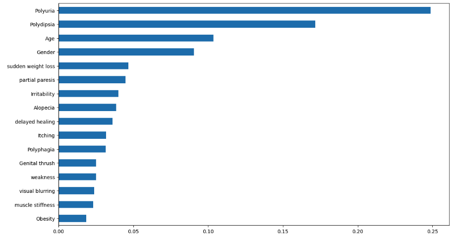

# Diabetes-Detection

## Diabetes Prediction Model

In this project, I have developed a machine learning model to predict the likelihood of diabetes using the Early Stage Diabetes Risk Prediction dataset. The dataset was collected through direct questionnaires from patients at the Sylhet Diabetes Hospital in Sylhet, Bangladesh, and has been approved by a doctor. It contains comprehensive sign and symptom data of individuals who have either recently been diagnosed with diabetes or are at risk of developing the condition.

## Making of the Model:
**Feature Engineering**: In the process of applying machine learning, feature engineering techniques were employed to discover essential features that would enhance the predictive power of the model. Techniques such as feature selection, dimensionality reduction, and creating new features based on domain knowledge were used.

**Encoding Categorical Variables**: Categorical variables present in the dataset were encoded into numerical representations to make them compatible with machine learning algorithms. Techniques like one-hot encoding or label encoding were applied to transform categorical data.

**Train-Test Split**: The dataset was split into training and testing sets to evaluate the performance of the model accurately. The training set was used to train the machine learning algorithm, while the testing set was used to assess the model's predictive capabilities on unseen data.

**Applying Machine Learning Algorithm**: Various machine learning algorithms, such as logistic regression, random forest, or support vector machines, were applied to train a model on the training data. The algorithm learned the patterns and relationships in the data to make predictions on new instances.

**Cross-Validation**: Cross-validation techniques, such as k-fold cross-validation, were employed to assess the model's performance and ensure its generalizability. This helps to mitigate the risk of overfitting and provides a more robust evaluation of the model.

**Model Evaluation**: The trained model was evaluated using appropriate evaluation metrics such as accuracy, precision, recall, or F1 score. The performance of the model was assessed to determine its effectiveness in predicting diabetes in individuals based on the given features.

## Results
The results for the Feature Importance and the ROC curve are present below:

### Feature Importance :

### ROC Curve:

